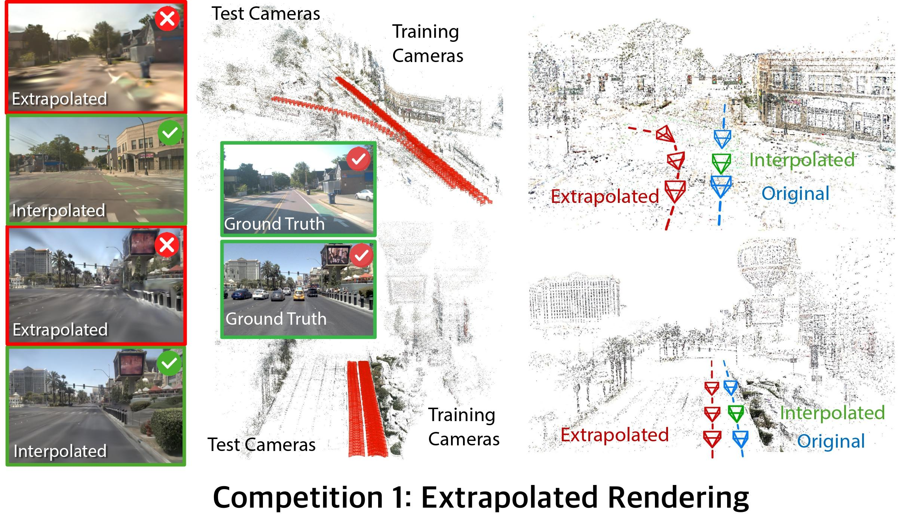
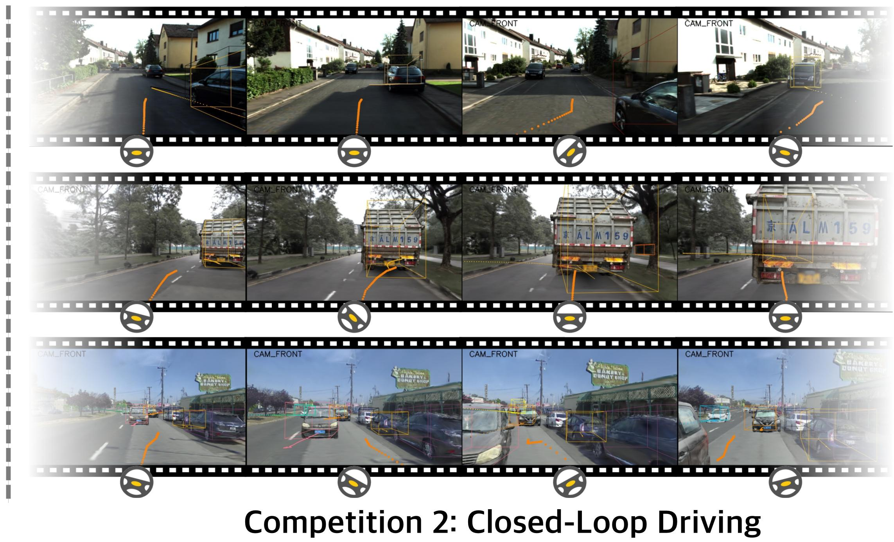
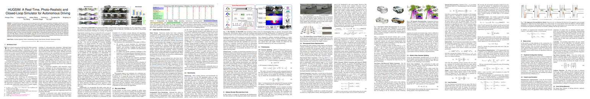
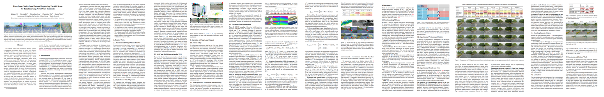
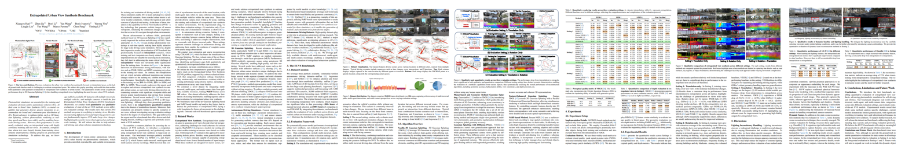
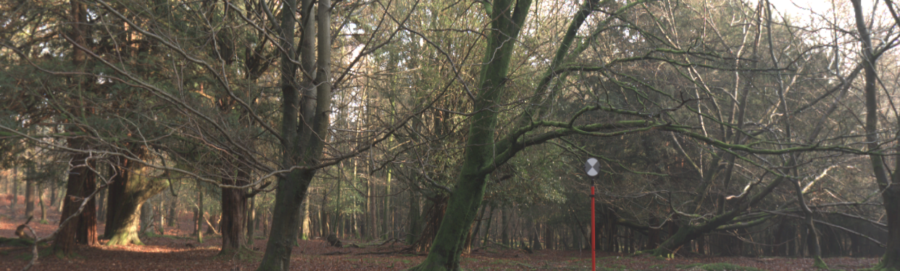
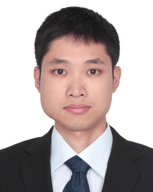
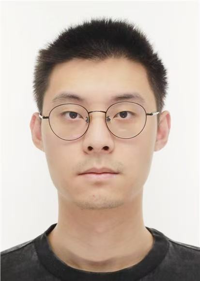

:wave: Welcome to the RealADSim Workshop organized at :wave: 

{: .text-center}

Join us on **19 Oct 2025** from **12:00 - 17:45 HST**
{: .text-center}

**Introduction:** Given the safety concerns and high costs associated with real-world autonomous driving testing, high-fidelity simulation techniques have become crucial for advancing the capabilities of autonomous systems. While classical driving simulators offer closed-loop evaluation, they still exhibit a domain gap compared to the real world. In contrast, offline-collected driving datasets avoid this gap but struggle to provide closed-loop evaluation. Novel View Synthesis (NVS) has recently opened up new possibilities by enabling closed-loop driving simulation directly from real-world data, which has attracted great attention. This creates a promising alternative for evaluating autonomous driving algorithms in dynamic, interactive environments. However, while NVS-based simulation unlocks new opportunities, there are two key questions that are yet to be answered: 1) How well can we render? 2) How well can we drive?

<!-- 
## :page_facing_up: **Paper**

<small>Zhou, H., ...,  Liao, Y. (2024). HUGSIM: A Real-Time, Photo-Realistic and Closed-Loop Simulator for Autonomous Driving.</small>

<small>Ni, Z., ..., Yang, S. (2025). Para-Lane: Multi-Lane Dataset Registering Parallel Scans for Benchmarking Novel View Synthesis.</small>

<small>Han, X., ..., Li, Y. (2024). Extrapolated Urban View Synthesis Benchmark.</small>
-->

[//]: # (## :tv: **Video**)

[//]: # ()
[//]: # (<!-- #### Coming soon... -->)

## :newspaper: **News** {#news}
- **30 Jun 2025 ---** :rocket: The Workshop website is launched.
- **11 Mar 2025 ---** :gift: The Workshop is accepted!

---

## :hourglass_flowing_sand: **Important Dates** {#dates}

- **30 Jun 2025 (00:00 UTC) ---** Challenge Release
- **31 Aug 2025 (00:00 UTC) ---** Challenge Submission Due
- **05 Sep 2025 (00:00 UTC) ---** Release Results & Submit Technical Report
- **20 Sep 2025 (00:00 UTC) ---** Technical Report Due

---

## :calendar: **Schedule** {#schedule}

The workshop will take place on **19 Oct 2025** from **09:00 - 12:15 HST**.

> **NOTE**: Times are shown in **Hawaii Standard Time**. 
Please take this into account if you plan to join the workshop virtually.

| Time (PDT)    | Event                                                        |
|---------------|--------------------------------------------------------------|
| 09:00 - 09:10 | Welcome & Introduction                                       |
| 09:10 - 09:40 | Keynote-1                                                    |
| 09:40 - 10:10 | Keynote-2                                                    |
| 10:10 - 11:10 | Awards / Challenge winner Presentation                       |
| 11:10 - 11:40 | Keynote-3:                                                   |
| 11:40 - 12:10 | Keynote-4:                                                   |
| 12:10 - 12:15 | Closing remarks                                              |

---

## :microphone: **Invited Speakers** {#speakers}

<figure>
    
    <b> <a href="https://yuewang.xyz/">Yue Wang</a>
     Assistant Professor University of Southern California</b>
</figure>

<figure>
    
    <b> <a href="https://yuexinma.me/">​Yuexin Ma</a>
     Assistant Professor ShanghaiTech University</b>
</figure>

<figure>
    
    <b> <a href="https://jyhjinghwang.github.io/">Jyh-Jing Hwang</a>
     Research Scientist Waymo</b>
</figure>

<figure>
    
    <b> <a href="https://www.linkedin.com/in/peter-kontschieder-2a6410134/">Peter Kontschieder</a>
     Research Director Meta</b>
</figure>

[**Yue Wang**](https://yuewang.xyz/)
 is an Assistant Professor at USC CS, leading the Geometry, Vision, and Learning Lab. His current focus includes simulation, perception, and decision making. He obtained the Ph.D. degree from MIT EECS in 2022.

[**​Yuexin Ma**](https://yuexinma.me/)
 is an Assistant Professor in SIST, Shang- haiTech University. She received the PhD degree from the University of Hong Kong in 2019. Her current research focuses on scene understanding, multi-modal learning, autonomous driving, and embodied AI.

[**Jyh-Jing Hwang**](https://jyhjinghwang.github.io/)
 is a Research Scientist at Waymo Research, a technical lead for end-to-end autonomous driving. He received his Ph.D. degree in Computer and Information Science from the University of Pennsylvania.

[**Peter Kontschieder**](https://www.linkedin.com/in/peter-kontschieder-2a6410134/)
 is the Director of Research at Meta. He received his PhD in 2013 from Graz University of Technology. His research interests include photorealistic 3D scene reconstruction, semantic scene understanding, image-based 3D modeling, and generative models for 3D synthesis.

---

## :checkered_flag: **Competitions** {#competitions}

**Tracks**

We are holding two tracks in the workshop competitions:
- [Track 1: Extrapolated Urban Novel View Synthesis](https://huggingface.co/spaces/XDimLab/ICCV2025-RealADSim-NVS)

    In this track, we want to answer the question: how well can we Render? While NVS methods have made significant progress in generating photorealistic urban scenes, their performance still lags in extrapolated viewpoints when only a limited viewpoint is provided during training. However, extrapolated viewpoints are essential for closed-loop simulation. Improving the accuracy and consistency of NVS across diverse viewing angles is critical for ensuring that these simulators provide reliable environments for driving evaluation.
- [Track 2: Autonomous Driving in a Photorealistic Simulator](https://huggingface.co/spaces/XDimLab/ICCV2025-RealADSim-ClosedLoop)

    In this track, we want to answer the question: how well can we Drive? Despite challenges in extrapolated viewpoint rendering, existing methods enable photorealistic simulators with reasonable performance when trained on dense views. These NVS-based simulators allow autonomous driving models to be tested in a fully closed-loop manner, bridging the gap between real-world data and interactive evaluation. This shift allows for benchmarking autonomous driving algorithms under realistic conditions, overcoming the limitations of static datasets.

---

## 💰 **Award** {#award}

Each competition will have the following awards:

- Innovation Award: $9,000
- Outstanding Champion: $9,000
- Honorable Runner-up: $3,000

Winners will announce at ICCV2025 Workshop.

## 🏆 **Competition Winners** {#winners}
<!-- 
Congratulations to the challenge winners -- **HRI**!

|                |      | F&nbsp;(↑)                                                                | F&nbsp;(↑) (Edges)                                                    | MAE&nbsp;(↓)                                                             | RMSE&nbsp;(↓)                                                            | AbsRel&nbsp;(↓)                                                              | Acc&nbsp;(↑) (Edges)                                                 | Comp&nbsp;(↓) (Edges)                                                | δ<1.25&nbsp;(↑)                                                | δ<1.25^2&nbsp;(↑)                                                | δ<1.25^3&nbsp;(↑)                                                | 
|----------------|------|------------------------------------------------------------------|------------------------------------------------------------------|-----------------------------------------------------------------|-----------------------------------------------------------------|------------------------------------------------------------------|-----------------------------------------------------------------|-----------------------------------------------------------------|-----------------------------------------------------------------|-----------------------------------------------------------------|-----------------------------------------------------------------|
| **HRI** | A |   <strong>23.05</strong>  |  9.37  |  <strong>3.19</strong>  |  <strong>5.64</strong>  |  21.17  | 3.30 |  6.77 |  77.54  |  91.79  |  95.78   |
| **Anonymous** | | 22.95  | 9.21  | 3.44  | 6.48  | 24.65 | 3.27 |  <strong>6.59</strong>  |  76.17  | 90.33  | 94.73    | 
| <strong>PICO-MR</strong> |   | 22.58  | 8.26  | 3.41  | 5.89  | 22.02  | 4.02  | 11.28  | 76.18  | 90.95  | 95.44 |
| **Lavreniuk** | A | 20.81  | 9.12  |  3.40  |  5.77  |  <strong>20.48</strong>  | 3.20  |  7.27  | 75.33  |  91.33  |  <strong>95.97</strong>    |
| **Mach-Calib** | A |20.69  | 8.75  | 3.63  | 6.78  | 23.36  | 3.22  | 13.96  | 74.31  | 90.44  | 95.12     |
| **Anonymous** | | 20.50  | 8.63  | 3.68  | 7.07  | 23.96  | 3.17  | 13.66  | 74.00  | 90.32  | 95.01    |
| **EasyMono** | A | 20.24  | 7.30  | 3.43  | 5.91  | 22.47  | 3.91  | 20.98  | 74.73  | 90.55  | 95.24    |
| **Insta360-Percep** | A | 19.41  | 8.98  |  3.25 |  5.73  |  21.29  |  <strong>2.75</strong>  | 15.54  |  77.91  |  92.03  |  95.91     |
| **Anonymous** | | 18.85  | 8.27  | 4.06  | 7.06  | 26.35  | 3.11  | 13.75  | 67.57  | 87.98  | 94.18     |
| **HIT-AIIA** | A |18.53  |  9.74  | 3.83  | 6.29  | 23.96  |  3.06 | 9.90  | 69.12  | 88.49  | 94.31     |
| **Anonymous** | | 18.16  | 6.32  | 3.57  | 6.13  | 24.07  | 4.51  | 15.75  | 71.62  | 89.12  | 94.74     |
| **Anonymous** | | 17.46  |  9.35 | 4.43  | 7.30  | 29.19  | 3.27  | 17.69 | 65.64  | 86.45  | 93.09     |
| **Anonymous** | | 17.46  |  9.35 | 4.43  | 7.30  | 29.19  | 3.27  | 17.69  | 65.64  | 86.45  | 93.09    |
| **Anonymous** | | 17.45  |  9.35  | 4.43  | 7.30  | 29.20  | 3.27  | 17.69  | 65.64  | 86.46  | 93.10     |
| **Robot02-vRobotit** | A |17.25  | 8.27  | 3.90  | 6.54  | 23.64  | 3.07  | 22.85  | 71.07  | 89.38  | 94.80     |
| **Anonymous** | | 17.01  | 9.20  | 4.44  | 7.34  | 29.42  | 3.25  | 18.55  | 65.72  | 86.67  | 93.35     |
| **Anonymous** | | 17.01  | 9.20  | 4.44  | 7.34  | 29.42  | 3.25 | 18.55  | 65.72  | 86.67  | 93.35     |
| **Marigold** | A | 17.01  | 9.19  | 4.44  | 7.34  | 29.42  | 3.25  | 18.56  | 65.72  | 86.67  | 93.35 |
| **Anonymous** | | 16.79  | 9.10  | 4.51  | 7.44  | 30.10  | 3.32  | 17.65  | 65.24  | 86.22  | 93.05     |
| **Anonymous** | | 16.67  | 7.49  | 4.01  | 6.92  | 26.34  | 3.07  | 26.32  | 68.17  | 88.47  | 94.42     |
| **Anonymous** | | 16.47  | 8.99  | 4.74  | 7.71  | 30.93  | 3.26  | 18.75  | 62.26  | 84.27  | 91.90    |
| **ViGIR LAB** | | 16.25  | 8.54  | 5.37  | 9.00 | 43.72  | 3.29  | 14.15  | 61.99  | 82.89  | 90.46     |
| **Anonymous** | A |15.31  | 8.46  | 4.62  | 7.46  | 30.63  | 3.42  | 15.59  | 62.41  | 84.89  | 92.43     |
| **Anonymous** | | 15.03  | 7.64  | 5.48  | 9.29  | 38.59  | 3.70  | 20.33  | 58.82  | 81.79  | 90.85    |
| **Depth Anything v2**  |   | 14.34  | 6.72  | 4.84  | 9.13  | 33.57  | 2.99  | 35.54  | 66.34  | 86.02  | 92.44 |
| **HCMUS-DepthFusion** | A | 14.20  | 7.81  | 4.90  | 7.96  | 33.55  | 3.32  | 17.66  | 61.09  | 83.90  | 92.21     |
| **ReadingLS** | | 13.52  | 6.60  | 4.56  | 7.90 | 30.15  | 3.14  | 35.94  | 65.34  | 86.55  | 93.46    |

_Legend: **Baselines**; **3rd MDEC winning team**; A -- affine-invariant predictions_; for each metric we highlight **absolute best**, second best and third best -->

---

[//]: # (## :checkered_flag: **Challenge** {#challenge})

<!-- The challenge focuses on evaluating novel MDE techniques on the [SYNS-Patches dataset](https://arxiv.org/abs/2208.01489).
This dataset provides a challenging variety of urban and natural scenes, including forests, agricultural settings, residential streets, industrial estates, lecture theatres, offices, and more.
Furthermore, the high-quality, dense ground-truth LiDAR allows for the computation of more informative evaluation metrics, such as those focused on [depth discontinuities](https://arxiv.org/abs/1805.01328v1).

**[[GitHub Starter Pack](https://github.com/toshas/mdec_benchmark)] --- [[CodaLab Challenge](https://codalab.lisn.upsaclay.fr/competitions/21305)]**
{: .text-center}

### ⚡ What’s new in MDEC 2025? {#news}

- 📐 New prediction types: The challenge became more accessible thanks to the added support of `affine-invariant` predictions. `metric` and `scale-invariant` predictions are also automatically supported. `disparity` predictions, which were supported in previous challenges, are also accepted.
- 🤗 Pre-trained Model Support: We provide ready-to-use scripts for off-the-shelf methods: Depth Anything V2 (`disparity`) and Marigold (`affine-invariant`). These will serve as a competitive baseline for the challenge and a starting point for participants.
- 📊 Updated Evaluation Pipeline: The CodaLab grader code has been updated to accommodate the newly supported prediction types.

### 🚀 How to participate? {#participate}

1. Check out the new starter pack [GitHub](https://github.com/toshas/mdec_benchmark). The [mdec_2025](https://github.com/toshas/mdec_benchmark/tree/main/mdec_2025) folder contains scripts generating valid submissions for [Marigold](https://github.com/toshas/mdec_benchmark/blob/main/mdec_2025/marigold_v1-0/generate.py) (`affine-invariant`) and [Depth Anything v2](https://github.com/toshas/mdec_benchmark/blob/main/mdec_2025/depth_anything_v2/generate.py) (`disparity`).
2. Identify the prediction type of your method and generate a valid submission: `val` split for the "Development" phase and `test` split for the "Final" phase.
3. Register at the [CodaLab Challenge](https://codalab.lisn.upsaclay.fr/competitions/21305) site, check the submission constraints and extra conditions, and submit to the leaderboard.

The phases are open according to the following schedule:
- "Development": Feb 01 - Mar 01
- "Final": Mar 01 - Mar 21

### 📊 Evaluation {#evaluation}

Submissions will be evaluated on a variety of metrics:
- [Pointcloud reconstruction](https://arxiv.org/abs/2203.08122): F-Score
- [Image-based depth](https://arxiv.org/abs/1708.06500): MAE, RMSE, AbsRel
- [Depth discontinuities](https://arxiv.org/abs/1805.01328v1): F-Score, Accuracy, Completeness

The **leading metric** is **F-Score** (based on the point cloud), denoted as **F&nbsp;(↑)** in the leaderboard.
Challenge winners will be determined based on the performance ranked by the leading metric on the withheld validation ("Development" phase) and the test ("Final" phase) sets of the SYNS-Patches dataset.

To measure the performance locally with other datasets or troubleshoot scoring issues within the challenge, refer to the [evaluation code](https://github.com/toshas/mdec_benchmark/blob/main/src/core/evaluator.py).

### 📈 Baselines {#baselines}

This year, we switched to LSE-based alignment between predictions and ground truth maps to accept various types of predictions. 
In addition to previously accepted `disparity` prediction methods, we welcome `affine-invariant`, `scale-invariant`, and `metric` types.

Accordingly, we updated the benchmark with more recent baselines, such as Marigold (`affine-invariant`), Depth Anything v2 (`disparity`), and the winners of the 3rd edition of the MDEC challenge, whose performances are reported below.

|                |      F&nbsp;(↑)                                                                | F&nbsp;(↑) (Edges)                                                    | MAE&nbsp;(↓)                                                             | RMSE&nbsp;(↓)                                                            | AbsRel&nbsp;(↓)                                                              | Acc&nbsp;(↑) (Edges)                                                 | Comp&nbsp;(↓) (Edges)                                                | δ<1.25&nbsp;(↑)                                                | δ<1.25^2&nbsp;(↑)                                                | δ<1.25^3&nbsp;(↑)                                                | 
|----------------|------|------------------------------------------------------------------|------------------------------------------------------------------|-----------------------------------------------------------------|-----------------------------------------------------------------|------------------------------------------------------------------|-----------------------------------------------------------------|-----------------------------------------------------------------|
| **PICO-MR**    | 21.07          | 8.77 | 3.22 | 5.60 | 20.33                                                            | 3.69                                                            | 15.41                                                            | 0.7559                                                            | 0.9125                                                            | 0.9590                                                   
| **EVP++**    | 19.66          | 9.02 | 3.20 | 5.49 | 19.03                                                            | 2.66                                                            | 9.28                                                            | 0.7553                                                            | 0.9182                                                            | 0.9661                                                  
| **Marigold**    | 18.64          | 9.26 | 3.87 | 6.49 | 24.37                                                            | 2.90                                                            | 20.09                                                            | 0.6903                                                            | 0.8860                                                            | 0.9453                                                  
| **Depth Anything v2**    | 14.34          | 7.94 | 4.16 | 7.94 | 25.48                                                            | 2.64                                                            | 30.05                                                            | 0.6907                                                            | 0.8849                                                            | 0.9469                                                  
| **Garg's Baseline**    | 11.38          | 6.03 | 4.62 | 7.58 | 31.15                                                            | 4.01                                                            | 41.24                                                            | 0.5842                                                            | 0.8354                                                            | 0.9251

### 📚 Workshop proceedings {#proceedings}

As part of the CVPR Workshop Proceedings, we will publish a paper summarizing the results of the challenge. The following conditions must be met to have the method included in the paper:

- The method surpasses the performance of the baselines in the leading metric (F-Score);
- The method should not be trivial;
- Each prediction is made using a single corresponding input image;

Once the challenge has finished, we will contact the participants meeting the criteria above to request information about their affiliation, a short description of their method, and the method's source code. Participants not providing this information will not be added to the publication; their submission will stay anonymous in the leaderboard.

Selected top performers will also be invited to present their methods at the workshop. The presentation can be held either in person or virtually. This is mandatory; refusal to do so will result in an invalidated submission and removal from the paper.

## Feedback {#feedback}

Please feel free to reach out with any questions, concerns, or feedback using the address below — this is the quickest way to contact us. If your topic relates to the challenge, in addition to emailing us, consider opening a discussion on the [CodaLab forum](https://codalab.lisn.upsaclay.fr/forums/21249/).

 -->

---

## 🤵 **Organizers** {#organizers}

<figure>
    
    <b> <a href="https://yiyiliao.github.io/">Yiyi Liao</a>
     Zhejiang University</b>
</figure>
    
<figure>
    
    <b> <a href="https://hyzhou404.github.io/">Hongyu Zhou</a>
     Zhejiang University</b>
</figure>

<figure>
    
    <b> <a href="https://yichonglu.github.io/">Yichong Lu</a>
     Zhejiang University</b>
</figure>

<figure>
    
    <b> <a href="https://www.aminer.cn/profile/liu-bingbing/562d234145cedb3398d63523">Bingbing Liu</a>
     Huawei</b>
</figure>

<figure>
    
    <b> <a href="https://ieeexplore.ieee.org/author/37859161500">Hongbo Zhang</a>
     Huawei</b>
</figure>

<figure>
    
    <b> <a href="https://openreview.net/profile?id=~Jiansheng_Wei1">Jiansheng Wei</a>
     Huawei</b>
</figure>

<figure>
    
    <b> <a href="https://openreview.net/profile?id=%7EZiqian_Ni1">Ziqian Ni</a>
     Cainiao</b>
</figure>

<figure>
    
    <b> <a href="https://yimingli-page.github.io/">Yiming Li</a>
     NVIDIA & NYU</b>
</figure>

<figure>
    
    <b> <a href="https://www.cvlibs.net/">Andreas Geiger</a>
     University of Tübingen</b>
</figure>

